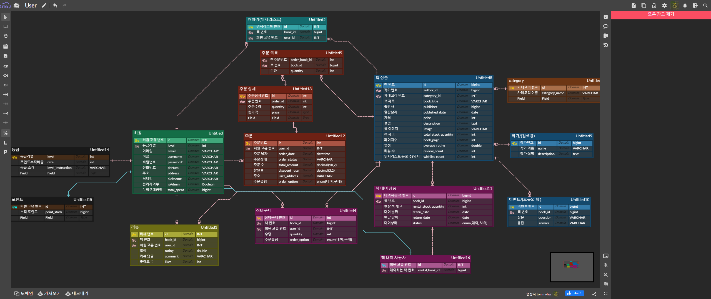

# 📖 온라인 서점 웹사이트 (Book-Store-Rent-WebSite-Project2)

이 프로젝트는 온라인으로 책을 구매할 수 있는 웹 사이트입니다. Spring Boot 기반의 백엔드와 HTML, CSS, JavaScript로 구성된 프론트엔드를 가집니다.

## 📑 목차

*   [✨ 주요 기능](#-주요-기능)
*   [📊 ERD](#-erd)
*   [📜 API 명세서](#-api-명세서)
*   [🛠️ 기술 스택](#️-기술-스택)
    *   [🖥️ 백엔드 (Backend)](#️-백엔드-backend)
    *   [🌐 프론트엔드 (Frontend)](#-프론트엔드-frontend)
*   [⚙️ 프로젝트 설정 및 실행 방법](#️-프로젝트-설정-및-실행-방법)
    *   [📋 전제 조건](#-전제-조건)
    *   [🚀 실행](#-실행)
*   [📁 폴더 구조 (주요 부분)](#-폴더-구조-주요-부분)

## ✨ 주요 기능

*   **👤 사용자 (User)**
    *   회원가입, 로그인 및 로그아웃 (OAuth2 소셜 로그인 기능 지원 - `spring-boot-starter-oauth2-client` 의존성 포함)
    *   회원 정보 조회 및 수정, 회원 탈퇴
    *   (관리자) 회원 관리 기능
*   **📚 상품 (Product/Book)**
    *   상품 목록 조회 (카테고리별, 검색 등)
    *   상품 상세 정보 조회
    *   (관리자) 상품 등록, 수정, 삭제
*   **🗂️ 카테고리 (Category)**
    *   카테고리별 상품 조회
    *   (관리자) 카테고리 추가, 수정, 삭제
*   **🛒 장바구니 (Cart)**
    *   상품 장바구니에 담기
    *   장바구니 목록 조회, 수량 변경, 삭제
*   **📦 주문 (Order)**
    *   상품 주문 및 결제 (상세 결제 방식은 API 명세 또는 코드 확인 필요)
    *   주문 내역 조회
    *   (관리자) 주문 관리 (상태 변경 등)

## 📊 ERD


## 📜 API 명세서


## 🛠️ 기술 스택

### 🖥️ 백엔드 (Backend)

*   **언어**: 
*   **프레임워크**: 
    *   Spring Data JPA
    *   Spring Security (JWT, OAuth2 Client - `spring-boot-starter-oauth2-client` 의존성 포함)
    *   Spring Web
    *   Spring AOP
*   **데이터베이스**:
    *   
    *   
*   **클라우드 서비스**:  (파일 스토리지 - 예: 상품 이미지)
*   **기타**:
    *   Lombok
    *   MapStruct
    *   Jasypt (설정 파일 암호화)
    *    (빌드 및 의존성 관리)

### 🌐 프론트엔드 (Frontend)

*   **구성**: Spring Boot가 직접 서빙하는 정적 HTML, CSS, JavaScript 파일들로 구성 (`src/main/resources/static` 위치)
*   **언어**:
    *   
    *   
    *   
*   **CSS 프레임워크**:
    *   
    *   Bulma-Carousel (CDN 또는 `static` 폴더 내 직접 포함 방식)
*   **JavaScript 라이브러리/SDK**:
    *    (S3 연동 - CDN 또는 `static` 폴더 내 직접 포함 방식)
*   **패키지 매니저**:  (`package.json` 파일은 주로 프론트엔드 라이브러리 목록 관리용으로 사용되며, 별도의 프론트엔드 빌드 과정(예: `npm run build`)은 없습니다.)

## ⚙️ 프로젝트 설정 및 실행 방법

### 📋 전제 조건

*   Java 17 (JDK) 설치
*   MySQL 서버 실행 및 관련 스키마/데이터 준비
*   Redis 서버 실행
*   (필요시) AWS S3 버킷 생성 및 자격 증명 설정
*   `application.yml` (또는 `application.properties`) 파일에 데이터베이스, Redis, AWS S3, Jasypt 암호화 키 등 환경에 맞는 주요 설정 정보 입력

### 🚀 실행

1.  프로젝트 루트 디렉터리에서 다음 명령어를 실행하여 프로젝트를 빌드합니다:
    ```bash
    # Windows
    gradlew.bat build

    # Linux/MacOS
    ./gradlew build
    ```
2.  빌드가 성공하면 다음 명령어로 Spring Boot 애플리케이션을 실행합니다:
    ```bash
    java -jar build/libs/Book-Store-Rent-WebSite-Project2-0.0.1-SNAPSHOT.jar
    ```
    (jar 파일명은 `build.gradle`의 `version` 설정에 따라 다를 수 있습니다.)
3.  애플리케이션 실행 후, 웹 브라우저에서 `http://localhost:포트번호` (포트번호는 Spring Boot 설정에 따름, 기본 8080) 등으로 접속합니다. 프론트엔드 파일은 백엔드 애플리케이션에 의해 직접 제공됩니다.

## 📁 폴더 구조 (주요 부분)

```
.
├── gradle/                     # Gradle 래퍼 파일
├── src/
│   ├── main/
│   │   ├── java/
│   │   │   └── io/elice/shoppingmall/  # Spring Boot 애플리케이션 (Java 소스 코드)
│   │   │       ├── ShoppingMallApplication.java # 메인 애플리케이션 클래스
│   │   │       ├── config/             # (추정) AppConfig, AwsS3Config, JasyptConfig, WebConfig 등
│   │   │       ├── user/               # 사용자 관련 기능 (Controller, Service, Repository, DTO 등)
│   │   │       ├── product/            # 상품 관련 기능
│   │   │       ├── order/              # 주문 관련 기능
│   │   │       ├── category/           # 카테고리 관련 기능
│   │   │       ├── cart/               # 장바구니 관련 기능
│   │   │       └── etc/                # 기타 유틸리티 또는 공통 모듈
│   │   ├── resources/
│   │   │   ├── static/         # 프론트엔드 정적 파일 (HTML, CSS, JS, 이미지 등)
│   │   │   │   ├── css/        # (예시) CSS 파일 위치
│   │   │   │   ├── js/         # (예시) JavaScript 파일 위치
│   │   │   │   └── images/     # (예시) 이미지 파일 위치
│   │   │   ├── templates/      # 서버 사이드 템플릿 (거의 사용되지 않음)
│   │   │   ├── application.yml # (또는 application.properties) Spring Boot 설정 파일
│   │   │   └── ...             # 기타 리소스 (SQL 스크립트, 데이터 파일 등)
│   │   └── generated/          # (있다면) MapStruct 등 코드 생성 결과물
│   └── test/
│       └── java/               # Java 테스트 코드
├── build.gradle                # 백엔드 빌드 및 의존성 설정
├── gradlew                     # Gradle 실행 스크립트 (Linux/MacOS)
├── gradlew.bat                 # Gradle 실행 스크립트 (Windows)
├── package.json                # 프론트엔드 라이브러리 목록 관리 (빌드 스크립트 없음)
└── README.md                   # 본 프로젝트 설명 파일
```